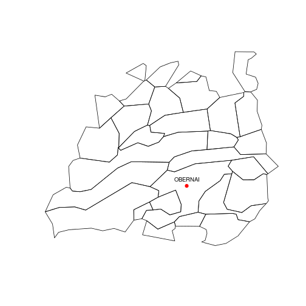
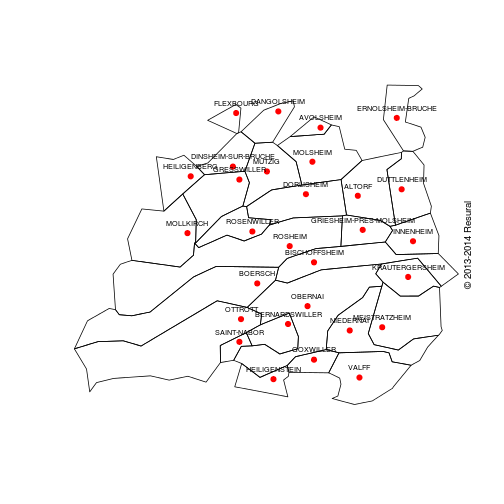
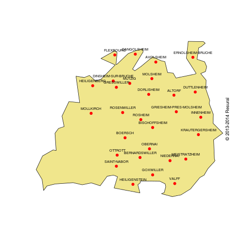

Etapes projet Minoux
========================================================

Zone de proximité de Sélestat
-----------------------------

Il faut récupérer le fichier *base.Rda*

Variables:
- base: résultat de la lecture de carto_alsace.Rda: dataframe de 904 lignes correspondant auc communes d'Alsace et 31 colonnes correspondant aux caractéristiques de chaque commune


```r
# Pour supprimer la notation scientifique:
options(scipen = 6, digits = 2)

load("../RPU_2013/doc/cartographie/RPU2013_Carto_Pop/base.Rda")
zp_selestat <- base[base$zone_proximite == "7", "ville_nom"]
write.table(zp_selestat, file = "zp_selestat.csv", sep = ",")
```


Création de la zone Obernai (zo)
--------------------------------

Fichiers nécessaires:
- carto_alsace.rda
- secteur_Obernai.csv

Variables:
- als: résultat de la lecture de **carto_alsace.Rda**: SpatiialPolygon contenant
  - les limites géographiques de chaque commune d'Alsace
  - un dataframe *als@data* contenant les caractéritiques IGN de ces communes
- zpo: dataframe des 29 communes du secteur d'Obernai et 6 colonnes dont le dode INSEE de chaque commune. Le fichier a été construit à partir de la liste de JMM croisée avec la iste des communes d'Alsace de wikipedia (cf Readme)
- zpob: vecteur correspondant à la colonne code_INSEE de zpo
- zp1: sous-ensemble de *als* obtenu en croisant *als* et *zpob* au travers de la méthode %in%. On obtient un *SpatiialPolygon* limités aux 29 communes du secteur d'Obernai. On sauvegarde ce fichier sous le nom de **zp_obernai.Rda**, correspondant au fond de carte du secteur.


```r
library("maptools")
```

```
## Loading required package: foreign
## Loading required package: sp
## Loading required package: grid
## Loading required package: lattice
## Checking rgeos availability: TRUE
```

```r
source("../copyright.R")
load("../RPU_2013/doc/cartographie/carto_alsace.rda")

zpo <- read.table("secteur_Obernai.csv", header = T, sep = ",")

zpob <- zpo$Code.Insee

zp1 <- als[als@data$INSEE_COM %in% zpob, ]
save(zp1, file = "zp_obernai.Rda")
# load('zp_obernai.Rda')
names(zp1)
```

```
##  [1] "ID_GEOFLA"  "CODE_COMM"  "INSEE_COM"  "NOM_COMM"   "STATUT"    
##  [6] "X_CHF_LIEU" "Y_CHF_LIEU" "X_CENTROID" "Y_CENTROID" "Z_MOYEN"   
## [11] "SUPERFICIE" "POPULATION" "CODE_CANT"  "CODE_ARR"   "CODE_DEPT" 
## [16] "NOM_DEPT"   "CODE_REG"   "NOM_REGION"
```

```r
plot(zp1)

# affichage de la commune d'Obernai
a <- zp1@data
obernai <- a[a$NOM_COMM == "OBERNAI", ]
x <- obernai$X_CHF_LIEU * 100
y <- obernai$Y_CHF_LIEU * 100
nom <- obernai$NOM_COMM
points(x, y, pch = 19, col = "red")
text(x, y, labels = nom, pos = 3, cex = 0.8)
copyright()
```

 

```r

# Affichage du nom de toutes les communes
plot(zp1)
x <- a$X_CHF_LIEU * 100
y <- a$Y_CHF_LIEU * 100
points(x, y, pch = 19, col = "red")
nom <- a$NOM_COMM
text(x, y, labels = nom, pos = 3, cex = 0.6)
copyright()
```

 

```r

# formation d'une région par fusion des polygones
contour <- unionSpatialPolygons(zp1, IDs = zp1@data$NOM_DEPT)
```

```
## Loading required package: rgeos
## rgeos version: 0.3-3, (SVN revision 437)
##  GEOS runtime version: 3.3.3-CAPI-1.7.4 
##  Polygon checking: TRUE
```

```r
plot(contour, col = "khaki")
x <- a$X_CHF_LIEU * 100
y <- a$Y_CHF_LIEU * 100
points(x, y, pch = 19, col = "red")
nom <- a$NOM_COMM
text(x, y, labels = nom, pos = 3, cex = 0.6)
copyright()
```

 


Population du secteur d'Obernai (24/3/2014)
-------------------------------

On utilise le fichier pop67.Rda  
On récupère la liste des communes du secteur Obernai (avec une modification pour Boersch), dont on fait un dataframe. On merge les 2 dataframe.


```
## [1] "/home/jcb/Documents/Resural/Stat Resural/Minoux"
```


```r
kable(obernai)
```

|cc                       |insee  |  Population.municipale|
|:------------------------|:------|----------------------:|
|Altorf                   |67008  |                   1273|
|Avolsheim                |67016  |                    728|
|Bernardswiller           |67031  |                   1422|
|Bischoffsheim            |67045  |                   3272|
|Boersch                  |67052  |                   2437|
|Dangolsheim              |67085  |                    664|
|Dinsheim-sur-Bruche      |67098  |                   1365|
|Dorlisheim               |67101  |                   2478|
|Duttlenheim              |67112  |                   2876|
|Ernolsheim-Bruche        |67128  |                   1660|
|Flexbourg                |67139  |                    479|
|Goxwiller                |67164  |                    822|
|Gresswiller              |67168  |                   1538|
|Griesheim-près-Molsheim  |67172  |                   2036|
|Heiligenberg             |67188  |                    654|
|Heiligenstein            |67189  |                    966|
|Innenheim                |67223  |                   1115|
|Krautergersheim          |67248  |                   1689|
|Meistratzheim            |67286  |                   1411|
|Mollkirch                |67299  |                    962|
|Molsheim                 |67300  |                   9215|
|Mutzig                   |67313  |                   5664|
|Niedernai                |67329  |                   1232|
|Obernai                  |67348  |                  10731|
|Ottrott                  |67368  |                   1634|
|Rosenwiller              |67410  |                    674|
|Rosheim                  |67411  |                   4834|
|Saint-Nabor              |67428  |                    476|
|Valff                    |67504  |                   1254|

Population totale: 65561


EHPAD du secteur (24/3/2014)
----------------

|id  |cc             |  Numero.FINESS|Raison.sociale                          |Adresse                      |  Code.postal|Tel              |Lib.categorie       |  FINESS.juridique|  capacite.tot|
|:---|:--------------|--------------:|:---------------------------------------|:----------------------------|------------:|:----------------|:-------------------|-----------------:|-------------:|
|4   |BISCHOFFSHEIM  |      670781046|MR RESIDENCE MARIE ROBERTA EHPAD        |4 RUE DE L'HOPITAL           |        67870|03 88 50 41 13   |Maison de Retraite  |         670000538|            44|
|8   |DORLISHEIM     |      670783216|MR SAREPTA DORLISHEIM - EHPAD           |4 RUE LUTHER                 |        67120|03 88 47 94 30   |Maison de Retraite  |         670000827|           137|
|21  |MOLSHEIM       |      670793736|MR HOPITAL LOCAL DE MOLSHEIM - EHPAD    |5 COUR DES CHARTREUX         |        67120|03 88 49 70 70   |Maison de Retraite  |         670780642|           164|
|22  |MOLSHEIM       |      670790930|RESIDENCE BON REPOS A MOLSHEIM          |1 RUE DES ETANGS             |        67120|03 88 38 51 31   |Logement Foyer      |         670792530|            62|
|23  |MOLSHEIM       |      670797703|RES LES PEUPLIERS A MOLSHEIM            |2 RUE DES ETANGS             |        67120|03 88 38 51 31   |Logement Foyer      |         670792530|            24|
|24  |MUTZIG         |      670793785|MR DE MUTZIG EHPAD                      |7 RUE DE L'HOPITAL           |        67190|03 88 38 13 76   |Maison de Retraite  |         670780659|           100|
|25  |MUTZIG         |      670790955|RESIDENCE BON SEJOUR A MUTZIG           |9 RUE DOCTEUR SCHWEITZER     |        67190|03 88 38 51 31   |Logement Foyer      |         670792530|            46|
|27  |OBERNAI        |      670790948|RESIDENCE HOHENBOURG A OBERNAI          |RUE DU FOYER                 |        67210|03 88 95 56 76   |Logement Foyer      |         670792548|            68|
|30  |ROSHEIM        |      670793751|MR DE L'HOPITAL LOCAL DE ROSHEIM EHPAD  |14 RUE DU GENERAL DE GAULLE  |        67560|03 88 50 40 50   |Maison de Retraite  |         670780675|            90|
|31  |ROSHEIM        |      670798974|MR DU COUVENT DE ROSHEIM                |3 RUE SAINT BENOIT           |        67560|03 88 50 41 67   |Maison de Retraite  |         670798966|             9|
|33  |VALFF          |      670009349|UNITE DE VIE PA LES CHEVREFEUILLES      |186 RUE PRINCIPALE           |        67210|03 88 08 75 93   |Maison de Retraite  |         670009299|            15|


